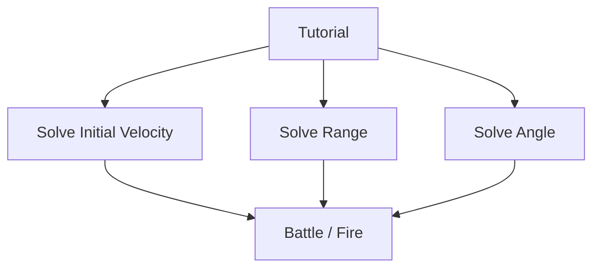

# Arithmetic Practice Generator (Unity / C#)

## Overview

This project implements a pedagogically controlled arithmetic exercise generator designed for educational environments and scalable across multiple academic levels (primary → secondary → high school).

The engine generates exercises that are:

* mathematically exact
* validation-mode consistent
* difficulty-controlled
* readable for students
* deterministic and reproducible
* configurable directly from Unity Inspector

Supported operations:

* Addition
* Subtraction
* Multiplication
* Division

---

# New in v1.1

Version **1.1** introduces a **Difficulty Constraint Engine** that allows precise control over operand complexity per operation.

New inspector-controlled parameters:

| Operation      | Integer Digits | Decimal Digits |
| -------------- | -------------- | -------------- |
| Addition       | configurable   | configurable   |
| Subtraction    | configurable   | configurable   |
| Multiplication | configurable   | configurable   |
| Division       | configurable   | configurable   |

Division additionally supports:

```
maxDivisionExactOperandDecimals
```

for controlling readability in Exact mode.

The generator now prevents impossible pedagogical configurations automatically.

---

# Features

## Supported Operations

* Addition
* Subtraction
* Multiplication
* Division

---

## Supported Validation Modes

| Mode      | Description                                 |
| --------- | ------------------------------------------- |
| ExactOnly | User must enter the exact result            |
| Truncated | User must truncate to selected decimals     |
| Ceil      | User must round upward to selected decimals |
| All       | Any valid transformation accepted           |

---

## Supported Sign Modes

| Mode         | Behavior                  |
| ------------ | ------------------------- |
| PositiveOnly | Both operands positive    |
| NegativeOnly | Both operands negative    |
| Mixed        | Operand signs independent |

---

# Difficulty Control System (NEW)

Difficulty can now be controlled independently for each operation:

```
integer digits
decimal digits
```

Configured via Unity Inspector:

```
GameSettings
```

Example:

```
Addition
  integers: 2 digits
  decimals: 1 digit

Multiplication
  integers: 1 digit
  decimals: 3 digits
```

This enables curriculum-aligned exercise generation.

---

# Inspector Constraint Guard System (NEW)

The generator automatically prevents invalid configurations such as:

```
Truncated mode with insufficient decimal difficulty
```

Example:

```
Validation decimals = 2
Difficulty decimals = 1
```

Automatically corrected to:

```
Difficulty decimals = 3
```

This guarantees pedagogical validity before generation begins.

ExactOnly mode remains fully independent from validation decimal settings.

---

# Pedagogical Guarantees

The generator enforces:

* exact arithmetic correctness
* maximum 6 decimal digits
* readable operands
* meaningful truncation exercises
* meaningful ceiling exercises
* no trailing-zero decimals
* no floating precision artifacts
* no impossible difficulty configurations

Example rejected:

```
5.120 ÷ 0.400
```

Example accepted:

```
5.125 ÷ 0.375
```

---

# Generation Strategies

Each operation uses a specialized deterministic strategy:

| Operation      | Strategy                    |
| -------------- | --------------------------- |
| Addition       | result → operands           |
| Subtraction    | result → operands           |
| Multiplication | operands → result           |
| Division       | result → divisor → dividend |

This guarantees exact decimal consistency.

---

# Operation-Specific Difficulty Logic (NEW)

Each operation now uses a specialized operand-generation pipeline:

Addition / Subtraction:

```
difficulty-aware result-first generation
```

Multiplication:

```
decimal-distribution-aware operand generation
```

Division:

```
result-driven operand reconstruction with readability constraints
```

This minimizes retry loops and increases generator stability.

---

# Exact Division Configuration

Exact division readability controlled via:

```
GameSettings.maxDivisionExactOperandDecimals
```

Example:

```
Primary school → 0
Secondary school → 1–2
High school → 3+
```

Additional integer-digit limits now apply to both divisor and dividend.

---

# Validation Mode Precision Rule

For:

```
Truncated
Ceil
All
```

the generator enforces:

```
Generated result decimals ≥ selectedDecimals + 1
```

This guarantees the transformation modifies the value.

---

# Designed For Educational Scaling

Supports:

```
Primary school
Secondary school
High school
```

Future-ready for:

```
adaptive difficulty
curriculum presets
teacher configuration profiles
student-level tracking
```

---

# Technical Structure

Core scripts:

```
MathExercise.cs
MathValidator.cs
GameSettings.cs
RoundUpController.cs
```

Responsibilities:

| Script            | Role                       |
| ----------------- | -------------------------- |
| MathExercise      | exercise generation engine |
| MathValidator     | answer validation          |
| GameSettings      | runtime configuration      |
| RoundUpController | UI interaction logic       |

---

# Generator Stability Architecture (NEW)

The engine now includes:

```
difficulty constraint guards
operation-aware operand generators
validation-mode compatibility enforcement
decimal-distribution-aware multiplication generation
division readability enforcement
```

This ensures deterministic pedagogical correctness across all modes.

---

# Future Extensions

Planned scalability:

* difficulty progression engine
* adaptive learning mode
* level-based operand ranges
* curriculum presets
* student performance tracking
* teacher configuration profiles

---

# License

Internal academic project (adjust as needed).

---

# Parabolic Shot Game (Antares)

Antares also includes a separate gameplay system focused on parabolic shooting and naval encounters.

This module is designed around:

* cannon angle control
* initial velocity control
* projectile range solving
* enemy detection and battle triggering
* cinematic boat movement with pursuit and escape behaviors
* avoidance between boats
* in-editor configuration for gameplay tuning

Main gameplay modes currently supported:

* Tutorial
* Solve Initial Velocity
* Solve Range
* Solve Angle

Mode flow diagram:




Additional systems included in this module:

* `FireCannonManager`
* `BoatMover`
* `StartGamePlay`
* `EncounterUIManager`

Core scripts and responsibilities:

| Script | Role |
| ------ | ---- |
| `FireCannonManager` | Cannon physics, mode management, and battle transition logic |
| `BoatMover` | Enemy and player boat movement, pursuit, escape, and avoidance |
| `StartGamePlay` | Battle phase startup and encounter flow control |
| `EncounterUIManager` | Encounter UI state and presentation |

This section documents the interactive projectile game as a distinct part of the project, separate from the arithmetic generator.
